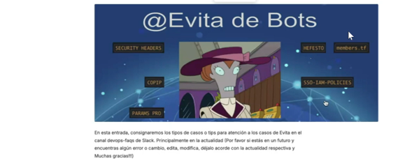

# Roadmap — Evolución de Arquitectura
## SRE Process Service — Capacidades Planificadas

**Autor:** Oscar Diaz | Platform & DevOps Engineer

---

## Visión



La arquitectura actual cubre infraestructura, seguridad y observabilidad.
La siguiente fase incorpora automatización operacional inteligente mediante
un agente centralizado denominado **@Evita**, integrando los sistemas de
alerta de AWS con los canales de comunicación y gestión del equipo.

El objetivo es reducir el MTTR y eliminar el toil operacional convirtiendo
eventos de infraestructura en acciones documentadas de forma automática.

---

## Evolución 1 — Agente @Evita (AIOps)

### Descripción

Agente operacional construido sobre AWS Lambda y Amazon Bedrock (Claude)
con integraciones a Slack, Jira REST API y AWS EventBridge. Implementa
el patrón Event-Driven AIOps: cada evento de seguridad u operacional
dispara una cadena de automatización sin intervención humana.

### Arquitectura

```
AWS EventBridge
      │
      ├── GuardDuty Finding
      ├── CloudWatch Alarm
      ├── Lambda Error
      └── Certificate Expiry
                │
                ▼
        Lambda @Evita-Processor
                │
      ┌─────────┼─────────┐
      ▼         ▼         ▼
  Slack API  Jira API  Bedrock
```

### Canales Slack

| Canal | Propósito |
|---|---|
| `#devops-security` | Findings GuardDuty + alarmas IAM |
| `#devops-monitoring-audit` | CloudTrail events críticos |
| `#devops-monitoring-certificados` | Certificados próximos a vencer |
| `#devops-incidents` | Incidentes P1/P2 con timeline automático |
| `#devops-faqs` | Respuestas automáticas vía Bedrock RAG |

### Flujo GuardDuty → Slack → Jira

```
1. GuardDuty detecta finding
2. EventBridge captura el evento en tiempo real
3. Lambda @Evita-Processor:
   a. Formatea mensaje con severidad y descripción
   b. Publica en #devops-security vía Slack Webhook
   c. Consulta Knowledge Base en Bedrock para análisis
   d. Crea ticket en Jira con prioridad según severidad
   e. Responde en el hilo de Slack con link al ticket
```

### Implementación Lambda

```javascript
exports.handler = async (event) => {
  const finding = event.detail;

  const analysis = await analyzeWithBedrock(finding);

  await notifySlack({
    channel: process.env.SLACK_SECURITY_CHANNEL,
    finding,
    analysis
  });

  const ticket = await createJiraTicket({
    summary: `GuardDuty: ${finding.type}`,
    description: analysis,
    priority: mapSeverityToPriority(finding.severity),
    labels: ['security', 'guardduty', 'automated']
  });

  return { ticketId: ticket.key };
};
```

---

## Evolución 2 — Monitor de Certificados SSL

### Descripción

Lambda con EventBridge Schedule (cron diario 06:00 UTC) que lista objetos
en S3 con extensiones `.cer/.p12/.jks/.pem`, extrae la fecha de expiración
usando el módulo `crypto` de Node.js y dispara notificaciones multi-canal
para certificados con menos de 35 días de vigencia.

### Arquitectura

```
EventBridge Schedule → Lambda cert-monitor → S3 ListObjects
                                │
                    ┌───────────┼───────────┐
                    ▼           ▼           ▼
               Jira API    Slack Hook    SES Email
               (ticket)   (#devops-     (arquitecto
                           certs)       responsable)
```

### Umbrales de notificación

| Días restantes | Prioridad Jira | Canales |
|---|---|---|
| 35 días | Media | Slack + Jira |
| 15 días | Alta | Slack + Jira + Email |
| 7 días | Crítica | Slack + Jira + Email |
| Vencido | Bloqueante | Todos |

### Estructura del ticket Jira generado

```
Título: Certificado próximo a vencer: <nombre>
Campos:
  - Certificado: <path S3>
  - Fecha expiración: <fecha>
  - Días restantes: <N>
  - Responsable: <arquitecto>
  - Labels: certificados, ssl, renovacion, automated
```

---

## Evolución 3 — Bedrock Knowledge Base

### Descripción

Knowledge Base en Amazon Bedrock con documentación técnica indexada
(runbooks, postmortems, procedimientos operacionales). @Evita usa
RAG (Retrieval Augmented Generation) para responder consultas en
`#devops-faqs` con contexto específico de la organización.

### Flujo RAG

```
Usuario en Slack → @Evita → Bedrock KB (búsqueda semántica)
                               │
                         Claude genera respuesta
                         con contexto del KB
                               │
                         Slack responde con
                         pasos + link Confluence
```

---

## Evolución 4 — Dashboard Ejecutivo

CloudWatch Dashboard extendido con métricas de negocio:
disponibilidad por servicio, MTTR histórico, certificados activos
vs próximos a vencer, findings de seguridad por severidad y costo
por servicio. Alimentado por GuardDuty, CloudTrail, RDS, Lambda
y ElastiCache.

---

## Timeline

```
Sprint 1 — COMPLETADO
  ✅ Infraestructura base (VPC, EC2, Lambda, RDS, Redis, S3)
  ✅ Seguridad (CloudTrail, GuardDuty, IAM)
  ✅ Observabilidad (CloudWatch, X-Ray, Grafana, Backup)
  ✅ CI/CD (GitHub Actions, Docker, Kubernetes)

Sprint 2
  ⬜ Lambda @Evita-Processor
  ⬜ Integración Slack Webhooks
  ⬜ EventBridge rules GuardDuty

Sprint 3
  ⬜ Lambda cert-monitor
  ⬜ Integración Jira REST API
  ⬜ SES notificaciones email

Sprint 4
  ⬜ Bedrock Knowledge Base
  ⬜ RAG en @Evita para #devops-faqs
  ⬜ Dashboard ejecutivo
```

---

## Impacto esperado

| Proceso actual | Con @Evita |
|---|---|
| GuardDuty alerta → revisión manual | Finding → ticket Jira automático |
| Cert vence → falla en producción | 35 días antes → ticket + notificación |
| Error Lambda → análisis manual de logs | Error → análisis IA + sugerencia |
| Consulta en Slack → esperar respuesta | @Evita responde desde KB en segundos |

---

*Oscar Diaz — Platform & DevOps Engineer*
